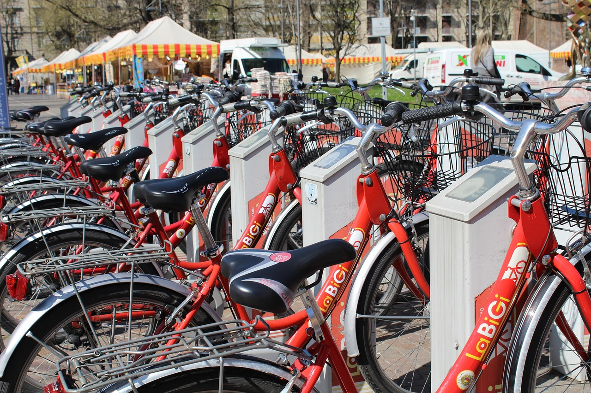

# Divvy-Trips-Analysis

Image by <a href="https://pixabay.com/users/sferrario1968-214554/?utm_source=link-attribution&utm_medium=referral&utm_campaign=image&utm_content=809728">Stefano Ferrario</a> from <a href="https://pixabay.com//?utm_source=link-attribution&utm_medium=referral&utm_campaign=image&utm_content=809728">Pixabay</a>

## Introduction

This analysis is for case study 1 from the Google Data Analytics Certificate (Cyclistic). We will be using the Divvy data sets for the case study. The purpose of this script is to consolidate downloaded Divvy data into a single data frame and then conduct simple analysis to help answer the key question: “In what ways do subscriber and customer riders use Divvy bikes differently?”

## Data Description

The data used is originally based on the case study “‘Sophisticated, Clear, and Polished’: Divvy and Data Visualization” written by Kevin Hartman found [here](https://artscience.blog/home/divvy-dataviz-case-study).

## Dependencies

The project was carried with python programming language by importing the following libraries:
* Pandas
* Numpy
* Matplotlib
* Seaborn

## Data Cleaning

To prepare the data for analysis, the following cleaning processes were carried out:
* Loading of data sets into a data frame (dfs).
* Inspecting column names of dfs.
* Renaming of column names to be consistent.
* Converting data types to be appropriate with column names of all dfs.
* Merging of dfs into a single bigger data frame.

## Data Analysis

The analysis were carried out by the following procedures:
* Computation of trip duration from start and end time columns of the dataframe.
* Calculation of statistical mean, median, max, and min of trip duration.
* Removal of observations with negative and N/A trip durations.
* Calculation of average trip duration by user type.
* Calculation of number of trips by user type.

## Visualizations

## Conclusions/Recommendations

Based on the analysis and findings above, maximizing the number of subscribers will go a long way in ensuring future success of the company. Below are some key insights derived;

* Subscribers recorded the highest numbers of rides for all the weekdays.
* Customers have higher number of trip duration across all weekdays.

Therefore, future marketing campaigns should focus on converting customers to subscribers for the success of the company.
